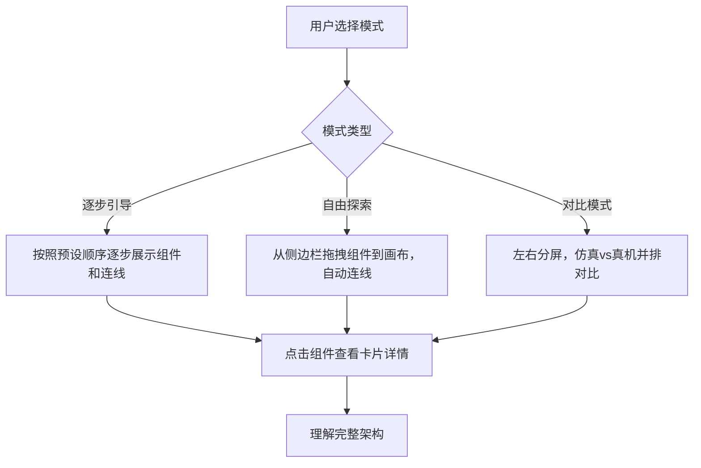

## 1. 产品概述

一个交互式 Web 工具，用于可视化理解 ROS 2 + Gazebo 机器人仿真系统中各框架、节点、插件之间的通信关系。用户通过拖拽组件逐步搭建系统架构图，直观看到每个组件加入后系统数据流的变化。

- 目标用户：ROS 2 初学者，被 ros_gz_bridge、gazebo_ros2_control、ros2_control、DiffDrive、controller_manager 等概念绕晕的开发者
- 解决的问题：扫清 ROS 2 仿真框架的概念障碍、通信机制障碍、框架关系障碍
- 核心价值：将抽象的框架关系转化为可交互、可拖拽、可对比的可视化图表

## 2. 核心功能

### 2.1 功能模块

1. **单机器人仿真模式（Gazebo 完整链路）**：从零开始拖拽组件，逐步搭建 gazebo_sim.launch.py 启动的完整系统
2. **真机模式（无 Gazebo）**：展示真实机器人上没有 Gazebo 时的框架，与仿真模式并排对比
3. **多机器人模式**：展示两个机器人同时加载进 Gazebo、各自运行 ros2_control 时的框架
4. **逐步引导模式**：按照逻辑顺序，组件一个一个出现，每步解释新组件带来的通信变化
5. **自由探索模式**：所有组件可见在侧边栏，用户自由拖入画布，自动连线
6. **概念卡片**：点击任意组件弹出详细解释（它是什么、输入输出、谁调用它、它调用谁）

### 2.2 页面详情

| 页面名称 | 模块名称 | 功能描述 |
|---------|---------|---------|
| 主页面 | 顶部模式切换栏 | 三个模式按钮：仿真模式 / 真机模式 / 仿真vs真机对比 / 多机器人模式 |
| 主页面 | 左侧组件库 | 可拖拽的组件列表，按类别分组（ROS 2 核心节点、Gazebo 组件、桥接组件、控制组件） |
| 主页面 | 中央画布 | 支持拖放组件、自动连线、缩放平移、组件高亮 |
| 主页面 | 右侧概念面板 | 选中组件后显示详细解释卡片 |
| 主页面 | 底部状态栏 | 显示当前模式、组件数量、连线数量 |
| 主页面 | 步骤引导弹窗 | 逐步引导模式下，每步显示解释文字和"下一步"按钮 |

## 3. 核心流程

### 逐步引导模式预设顺序（仿真模式）

1. 先放 `robot_description`（URDF 概念，xacro 展开）
2. 加入 `robot_state_publisher`（TF 广播）
3. 加入 `joint_state_publisher`（关节状态）
4. 展示 ROS 2 DDS 网络概念
5. 加入 Gazebo Fortress（Gazebo Transport 概念）
6. 加入 `ros_gz_sim create`（spawn 机器人）
7. 加入 DiffDrive 插件（旧方案）
8. 加入 `ros_gz_bridge`（桥接概念，为什么需要桥接）
9. 展示完整数据流：`/cmd_vel` → bridge → DiffDrive → /odom → bridge
10. 替换为 ros2_control 方案：`gazebo_ros2_control` 插件
11. 加入 `controller_manager`
12. 加入 `diff_drive_controller`（不经过 bridge！）
13. 展示新数据流：`/cmd_vel` → controller → hardware_interface → Gazebo
14. 移除 ros_gz_bridge（对比变化）

## 4. 用户界面设计

### 4.1 设计风格

- 主色调：深色背景（`#0f1419`），科技感暗色主题
- 强调色：青色（`#00d4ff`）用于连线和高亮，橙色（`#ff6b35`）用于警告和桥接
- 辅助色：紫色（`#a78bfa`）用于控制组件，绿色（`#34d399`）用于 ROS 2 节点
- 字体：`JetBrains Mono` 等宽字体（代码感），`Noto Sans SC` 用于中文
- 布局：左侧边栏 + 中央画布 + 右侧面板，三栏布局
- 组件卡片：圆角矩形，带发光边框（glow effect），模拟终端/控制台的科技感
- 连线：SVG 贝塞尔曲线，带箭头，不同颜色表示不同类型（命令/状态/TF）

### 4.2 页面设计概览

| 页面名称 | 模块名称 | UI 元素 |
|---------|---------|--------|
| 主页面 | 顶部模式栏 | 标签切换按钮组，当前选中高亮青色 |
| 主页面 | 左侧组件库 | 分组手风琴，每项可拖拽，hover 发光 |
| 主页面 | 中央画布 | 网格背景，节点可拖放移动，连线自动更新，支持滚轮缩放 |
| 主页面 | 右侧详情面板 | 选中组件后滑入，显示名称/包/可执行文件/订阅话题/发布话题/详细解释 |
| 主页面 | 逐步引导浮层 | 底部浮动卡片，显示当前步骤解释，上一步/下一步按钮 |

### 4.3 响应式

桌面优先设计，最小宽度 1280px，不支持移动端（这是开发工具，在电脑上用）。

## 5. 组件列表（待可视化）

### ROS 2 核心节点（绿色系）
- **robot_state_publisher**：接收 `/robot_description` + `/joint_states`，发布 `/tf` 和 `/tf_static`
- **joint_state_publisher**：发布 `/joint_states`
- **xacro 处理器**：将 `.xacro` 宏展开为完整 URDF
- **/robot_description**：参数服务器上的 URDF 字符串

### Gazebo 组件（青色系）
- **Gazebo Fortress（gz sim）**：仿真器本体，加载世界和物理引擎
- **Gazebo Transport**：Gazebo 内部零拷贝消息系统（不是 DDS！）
- **物理引擎**：ODE/Bullet/DART，模拟碰撞、摩擦力、重力
- **spawn_robot（ros_gz_sim create）**：从 `/robot_description` 读取 URDF，转换为 SDF，生成模型
- **DiffDrive 系统插件**：`libignition-gazebo-diff-drive-system.so`，差速解算 + 里程计 + TF
- **gazebo_ros2_control 系统插件**：`libgazebo_ros2_control.so`，硬件接口桥梁

### 桥接组件（橙色系 - 关键！）
- **ros_gz_bridge（parameter_bridge）**：ROS 2 DDS ↔ Gazebo Transport 双向消息翻译器
  - 不是"转发"，是"翻译"——两边消息格式不同
  - 一条桥接 = 一个单向或双向的消息转换通道

### ros2_control 组件（紫色系）
- **controller_manager**：管理 controller 的加载/卸载/切换
- **diff_drive_controller**：差速驱动控制器，订阅 `/cmd_vel`，发布 `/odom` 和 TF
- **硬件接口（gazebo_ros2_control/GazeboSystem）**：write() 关节速度指令，read() 关节状态

### 真机硬件组件（红色系）
- **真实电机驱动板**：接收 PWM/电压信号，驱动真实电机
- **真实编码器**：读取真实轮子转角
- **真实 IMU**：惯性测量单元
- **ros2_control 硬件接口（真实）**：如 `diffbot_hardware/DiffBotSystemHardware`，通过串口/CAN 与真实硬件通信
