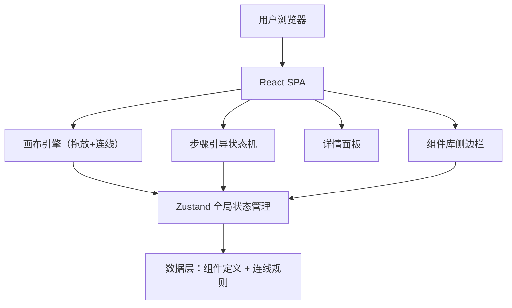

## 1. 架构设计



- **纯前端**：无需后端，所有数据和逻辑在浏览器中运行
- **无路由**：单页应用，通过状态切换模式，无需前端路由
- **无数据库**：组件定义、连线规则均为 TypeScript 常量

## 2. 技术方案

- 前端：React 18 + TypeScript + Tailwind CSS 3 + Vite
- 初始化工具：vite-init（react-ts 模板）
- 状态管理：Zustand
- 画布渲染：纯 SVG（贝塞尔曲线连线）+ HTML/CSS（组件卡片）
- 拖拽：HTML5 Drag and Drop API
- 图标：内联 SVG（自定义组件图标，不用 lucide-react，因为需要体现 ROS/Gazebo 特有图标）
- 后端：无

## 3. 项目结构

```
core/tools/
├── index.html
├── package.json
├── tsconfig.json
├── vite.config.ts
├── tailwind.config.js
├── postcss.config.js
└── src/
    ├── main.tsx
    ├── App.tsx
    ├── index.css
    ├── store/
    │   └── useStore.ts          # Zustand store：模式、画布节点、连线、选中节点、步骤
    ├── data/
    │   ├── components.ts        # 所有可视化组件的定义（id、名称、分类、颜色、输入输出话题）
    │   ├── connections.ts       # 连线规则（source 组件 + output → target 组件 + input）
    │   └── steps.ts             # 逐步引导模式的步骤定义
    ├── components/
    │   ├── Layout.tsx            # 三栏布局容器
    │   ├── Header.tsx            # 顶部模式切换栏
    │   ├── Sidebar.tsx           # 左侧组件库（可拖拽）
    │   ├── Canvas.tsx            # 中央画布（渲染节点 + SVG 连线）
    │   ├── CanvasNode.tsx        # 单个画布节点（可拖拽移动）
    │   ├── ConnectionLine.tsx    # SVG 连线（箭头 + 动画）
    │   ├── DetailPanel.tsx       # 右侧详情面板
    │   ├── StepGuide.tsx         # 逐步引导浮层
    │   └── StatusBar.tsx         # 底部状态栏
    └── types/
        └── index.ts             # TypeScript 类型定义
```

## 4. 数据模型

### 4.1 组件定义

```typescript
interface ComponentDef {
  id: string;                    // 唯一标识，如 'robot_state_publisher'
  name: string;                  // 显示名称
  category: 'ros2_core' | 'gazebo' | 'bridge' | 'ros2_control' | 'hardware';
  package: string;               // ROS 包名
  executable?: string;           // 可执行文件名
  description: string;           // 详细解释
  subscribes: TopicRef[];        // 订阅的话题
  publishes: TopicRef[];         // 发布的话题
  icon: string;                  // 内联 SVG 字符串
  // 概念边界（用于分组可视化）
  belongsTo: 'ros2_dds' | 'gz_transport' | 'both' | 'real_hardware';
}

interface TopicRef {
  topic: string;                 // 话题名，如 '/cmd_vel'
  type: string;                  // 消息类型，如 'geometry_msgs/msg/Twist'
  direction: 'in' | 'out';
  transport: 'ros2_dds' | 'gz_transport';  // 消息走什么传输层
}
```

### 4.2 画布状态（Zustand Store）

```typescript
interface CanvasState {
  mode: 'simulation' | 'real_robot' | 'compare' | 'multi_robot';
  guideMode: 'guided' | 'free';
  currentStep: number;           // 引导模式当前步骤
  nodes: CanvasNode[];           // 画布上的节点
  connections: Connection[];     // 画布上的连线
  selectedNodeId: string | null; // 当前选中的节点
  // actions
  addNode: (defId: string, robotId?: string) => void;
  removeNode: (nodeId: string) => void;
  moveNode: (nodeId: string, x: number, y: number) => void;
  selectNode: (nodeId: string | null) => void;
  setMode: (mode: string) => void;
  nextStep: () => void;
  prevStep: () => void;
  recomputeConnections: () => void; // 根据当前节点重新计算连线
}

interface CanvasNode {
  instanceId: string;            // 实例 ID（同一组件可出现多次）
  defId: string;                 // 对应的 ComponentDef.id
  x: number;
  y: number;
  robotId?: string;              // 多机器人模式下的归属
}

interface Connection {
  id: string;
  fromNodeId: string;
  fromPort: string;              // 来源端口（话题名）
  toNodeId: string;
  toPort: string;
  topic: string;
  type: 'cmd' | 'state' | 'tf' | 'bridge';
  transport: 'ros2_dds' | 'gz_transport' | 'cross';  // 跨传输层用 cross
}
```

## 5. 连线规则定义

连线规则在 `src/data/connections.ts` 中定义为映射表：

```typescript
// key: `${fromDefId}:${topic}` → { toDefId, toTopic }[]
const connectionRules: Record<string, Array<{to: string; toTopic: string; type: string}>> = {
  // robot_state_publisher 订阅
  'robot_state_publisher:/joint_states': [
    { to: 'joint_state_publisher', toTopic: '/joint_states', type: 'state' }
  ],
  'robot_state_publisher:/robot_description': [
    { to: 'xacro', toTopic: '/robot_description', type: 'state' }
  ],
  // ros_gz_bridge 桥接规则（cross 类型）
  'ros_gz_bridge:/cmd_vel': [
    { to: 'diff_drive_plugin', toTopic: '/cmd_vel', type: 'bridge' }
  ],
  'diff_drive_plugin:/odom': [
    { to: 'ros_gz_bridge', toTopic: '/odom', type: 'bridge' }
  ],
  // diff_drive_controller（ros2_control 下不经过 bridge）
  'diff_drive_controller:/cmd_vel': [
    { to: 'teleop', toTopic: '/cmd_vel', type: 'cmd' }
  ],
  'diff_drive_controller:/odom': [],  // 发布到 ROS 2 DDS，不需要连线到其他节点
  // ...
};
```

自动连线逻辑：遍历画布上所有节点，对于每个节点的每个 `publishes` 话题，查找是否有其他节点的 `subscribes` 匹配，如果匹配则创建连线。对于桥接规则，额外处理跨 `ros2_dds` / `gz_transport` 边界的情况。

## 6. 逐步引导步骤定义

```typescript
interface GuideStep {
  title: string;                 // 步骤标题
  description: string;           // 步骤解释文字
  addNodes: string[];            // 本步骤要添加的组件 defId 列表
  highlightConnection?: string;  // 本步骤要高亮的连线 ID
  removeNodes?: string[];        // 本步骤要移除的组件（用于对比）
  layout: Array<{defId: string; x: number; y: number}>; // 节点位置
}
```

## 7. 关键视觉设计

### 7.1 两种"世界"的分界

画布中用**虚线分隔带**区分 ROS 2 DDS 侧和 Gazebo Transport 侧：

```
┌─── ROS 2 DDS 世界 ───┐  ┌── Gazebo Transport 世界 ──┐
│  robot_state_publisher │  │  ┌─────────────────────┐  │
│  joint_state_publisher │  │  │  Gazebo Fortress     │  │
│  teleop_twist_keyboard │  │  │  ├ DiffDrive 插件     │  │
│  controller_manager    │  │  │  ├ gazebo_ros2_control│  │
│  diff_drive_controller │  │  │  └ 物理引擎           │  │
│         ↕               │  │         ↕                │
│    ros_gz_bridge ───────┼──┼── 跨越传输边界           │
└────────────────────────┘  └──────────────────────────┘
```

### 7.2 连线颜色

- **绿色 (`#34d399`)**：ROS 2 DDS 内部通信
- **青色 (`#00d4ff`)**：Gazebo Transport 内部通信
- **橙色 (`#ff6b35`)**：跨边界桥接（ros_gz_bridge），带脉冲动画
- **紫色 (`#a78bfa`)**：ros2_control 硬件接口通信（write/read）

### 7.3 多机器人模式

两个机器人各有一套完整的组件实例，通过 `robotId` 区分：
- fishbot（蓝色系边框）
- fishbot2（金色系边框）
- 共用一个 Gazebo 实例和 Gazebo Transport，但各自有独立的 `/model/fishbot/*` 和 `/model/fishbot2/*` 话题
